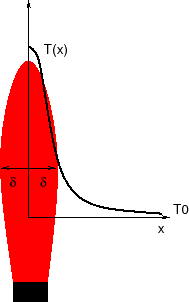

# Équation de diffusion non linéaire

Source: https://perso.univ-lyon1.fr/marc.buffat/COURS/COURSDF_HTML/node29.html

## Problème physique: diffusion dans une flamme

On veut calculer la répartition de température transversale dans une flamme. Pour cela on utilise un modèle simple, en supposant que dans la direction transverse (notée $x$) on a des échanges de chaleur uniquement par diffusion et par rayonnement.

Avec ces hypothèses, l'équation de conservation de l'énergie à l'état stationnaire dans la direction $x$ s'écrit:

$$ \underbrace{-\frac{\partial}{\partial}\left(\lambda\frac{\partial T}{\partial x}\right)}_{\mbox{diffusion}} + \underbrace{\sigma(T^{4}-T_{0}^{4})}_{\mbox{rayonnement}}=\underbrace{Q}_{\mbox{source}} $$

  
Dans ce modèle, l'énergie $Q$ produite dans la flamme de largeur $ 2\delta$ par réaction chimique est diffusée par conduction et rayonné vers l'air extérieur à température $ T_{0}$. Pour le rayonnement, nous avons adopté un modèle simple de rayonnement de corps noir proportionnel à $ T^{4}$ avec une constante de rayonnement $ \sigma$. Les variations de température entre la flamme et l'extérieur étant importantes (avec un rapport de l'ordre de 3 à 4), le coefficient de conduction $ \lambda$ dépend de la température à travers une loi en puissance !$ \lambda(T)=\lambda_{0}T^{q}$. Enfin pour le terme source, nous choisirons un terme de réaction constant dans la flamme et nul à l'extérieur.

En supposant que la flamme est symétrique, les conditions aux limites s'écrivent:

$$\frac{\partial T}{\partial x}(x=0)=0$$ 
et
$$T(x=L)=T_{0}$$ 

$L$ étant une distance grande par rapport à l'épaisseur $\delta$ de la flamme.

En posant $u=\frac{T}{T_{0}}$, le problème modèle associé s'écrit alors (en choisissant $L=1$ et $\delta=0.2$):

$$-\frac{\partial}{\partial}\left(\kappa(u)\frac{\partial u}{\partial x}\right)+\sigma(u^{4}-1)=Q(x),       x\in]0,1[$$

$$\frac{\partial u}{\partial x}(0)=0, u(1)=1$$

avec $$Q(x)=\beta  Heaviside(0.2-x)$$ et $$\kappa(u)=\kappa_{0}u^{q}$$.

### Étude analytique

Le problème étant non linéaire, il n'existe pas de solution analytique simple. Cependant dans le cas de faibles variations de $u$,

$$u\approx1   \Rightarrow\kappa(u)\approx\kappa_{0}, \sigma(u^{4}-1)\approx4\sigma(u-1)$$

on peut écrire un problème linéaire équivalent (en posant $\alpha=4\sigma$):

$$-\frac{\partial}{\partial}\left(\kappa_{0}\frac{\partial u}{\partial x}\right)+\alpha(u-1)=Q(x)$$.

### Discrétisation par différences finies

Pour résoudre numériquement le problème non linéaire, on le discrétise tout d'abord par différences finies centrées avec un maillage de pas $dx=1/N$ sous la forme:

$$-\left(\frac{\kappa_{i+\frac{1}{2}}\left(u_{i+1}-u_{i}\right)-\kappa_{i-\frac{1}{2}}\left(u_{i}-u_{i-1}\right)}{dx^{2}}\right)+\sigma\left(u_{i}^{4}-1\right)=Q_{i}    \forall i=0,N-1$$

en notant $\kappa_{i+\frac{1}{2}}=\kappa\frac{\kappa(u_{i+1})+\kappa(u_{i})}{2}$ et $\kappa_{i-\frac{1}{2}}=\frac{\kappa(u_{i-1})+\kappa(u_{i})}{2}$ les coefficients de diffusion en $i+\frac{1}{2}$ et $i-\frac{1}{2}$.

A ces équations on ajoute les 2 conditions aux limites:

1.  la condition de Neumann en $i=0$, traduite comme une condition miroir pour l'équation en $i=0$ :  $ u_{-1}=u_{1}$,
2.  la condition de Dirichlet en $i=N$ : $ u_{N}=1$.

On obtient ainsi $N+1$ équations non linéaires pour $N+1$ inconnues $ \{u_{i}\}_{i=0,N}$, que l'on écrit symboliquement sous la forme:

$$F_{i}(u_{0},u_{1},..u_{j}...,u_{N})=0, \forall i=0,N$$

Pour résoudre numériquement ces équations, on transforme le problème en un problème équivalent de point fixe :

$$u_{i}=G_{i}(u_{0},u_{1},..u_{j}...,u_{N}), \forall i=0,N$$

  
A partir de ce système , on construit une suite de valeurs $\{u_{i}^{k}\}_{i=0,N}$ telle que:

$$u_{i}^{k+1}=G_{i}(u_{0}^{k},u_{1}^{k},..u_{j}^{k}...,u_{N}^{k}), \forall i=1,N$$

  
Si la suite $ \{u_{i}^{k}\}_{i=0,N}$\ converge, elle converge vers un point fixe (i.e. une solution) et donc vers la solution du problème non linéaire initial. La condition de convergence de la suite de point fixe est donnée par le théorème classique du point fixe:

**théorème du point fixe:**

la suite itérative $(u^n)$ converge au voisinage d'un point fixe si et seulement si la matrice jacobienne $J$ de $G$ :  $J_{i,j}=\left(\frac{\partial G_{i}}{\partial u_{j}}\right)$, a une norme inférieure à $1$, i.e. possède dans ce voisinage des valeurs propres de modules inférieurs à $1$.

  
### Schéma explicite

Une première approche consiste à considérer la solution du problème initial comme solution stationnaire du problème instationnaire associé:

$$\frac{\partial u}{\partial t}-\frac{\partial}{\partial}\left(\kappa(u)\frac{\partial u}{\partial x}\right)+\sigma(u^{4}-1)=Q(x)$$

  

On discrétise cette équation avec du schéma différences finies explicite en temps:

$$\frac{u_{i}^{n+1}-u_{i}^{n}}{dt}-\left(\frac{\kappa^n_{i+\frac{1}{2}}\left(u^n_{i+1}-u^n_{i}\right)-\kappa^n_{i-\frac{1}{2}}\left(u^n_{i}-u^n_{i-1}\right)}{dx^{2}}\right)+\sigma\left(\left(u_{i}^{n}\right)^{4}-1\right)=Q_{i}$$

  

Ce schéma explicite s'écrit s'écrit sous la forme d'un problème de point fixe:

$$u_{i}^{n+1}=G_{i}(u_{0}^{n}..u_{N}^{n})$$

avec

$$G_{i} = u_{i}^{n}+dt\left(\frac{\kappa^n_{i+\frac{1}{2}}\left(u^n_{i+1}-u^n_{i}\right)-\kappa^n_{i-\frac{1}{2}}\left(u^n_{i}-u^n_{i-1}\right)}{dx^{2}}\right) - dt \sigma\left(\left(u_{i}^{n}\right)^{4}-1\right)+dt  Q_{i}$$

La matrice jacobienne $\mathcal{G}$ de $G$ est la matrice tridiagonale d'ordre $N+1$ suivante:

$$\mathcal{G}=\left[\begin{array}{cccccc}
a_{0} & 2 b_0 & 0 & & 0 & 0\\
c_{1} & a_{1} & b_{1} & & 0 & 0\\
0 & c_{2} & a_{2} & \ddots & 0 & 0\\
& & \ddots & \ddots & \ddots & \\
0& 0 & 0 & \ddots & a_{N-1} & b_{N-1}\\
0 & 0 & 0 & & 0 & 1\end{array}\right]$$

avec

$$a_{i} = \left(\frac{\kappa_{i+\frac{1}{2}}^{n}+\kappa_{i-\frac{1}{2}}}{dx^2}+\frac{\frac{1}{2}(\frac{\partial \kappa_i}{\partial u_i})(2u_i^{n}-u_{i-1}^{n}-u_{i+1}^{n})}{dx^{2}}+4\sigma\left(u_{i}^{n}\right)^{3}\right),$$

$$b_{i} = - \frac{\kappa_{i+\frac{1}{2}+}^{n}}{dx^{2}}+\frac{\frac{1}{2}(\frac{\partial\kappa_{i+1}}{\partial u_{i+1}})(u_{i+1}^{n}-u_{i}^{n})}{dx^{2}}$$

$$c_{i} =- \frac{\kappa_{i-\frac{1}{2}}^{n}}{dx^{2}}+\frac{\frac{1}{2}(\frac{\partial\kappa_{i-1}}{\partial u_{i-1}})(u_{i-1}^{n}-u_{i}^{n})}{dx^{2}}$$

Par définition, cette matrice Jacobienne relie une petite variation $\delta u_{i}^{n}$ de la solution à l'étape $n$ à la variation correspondante $\delta u_{i}^{n+1}$ à l'étape $n+1$ :

$$\left[\delta u_{i}^{n+1}\right]=\mathcal{G}\left[\delta u_{i}^{n}\right]$$

En interprétant $\delta u_{i}^{n}$ comme une perturbation, la relation précédente montre que la matrice $\mathcal{G}$ est la matrice d'amplification du schéma différences finies explicite, i.e. une perturbation $\epsilon_{i}^{n}$ de la solution vérifie

$$\displaystyle \left[\epsilon_{i}^{n+1}\right]=\mathcal{G}\left[\epsilon_{i}^{n}\right]$$

Or pour que le schéma soit stable, il faut que les valeurs propres de la matrice $\mathcal{G}$ soient en module inférieures à 1. Pour notre schéma, la condition de convergence de la méthode de point fixe est en faite une condition de stabilité sur le schéma explicite associé.

Pour pouvoir faire l'analyse simplement, on simplifie les coefficients de la matrice $\mathcal{G}$ en négligeant les termes en $\frac{1}{2}(\frac{\partial\kappa_{i}}{\partial u_{i}})$ devant ceux en $\kappa_{i}$ :

$$a_{i}\approx1-dt\left(\frac{\kappa_{i+\frac{1}{2}}^n + \kappa_{i-\frac{1}{2}}^n}{dx^{2}} + 4 \sigma (u_i^n)^3\right)$$

$$b_{i}\approx dt \frac{\kappa_{i+\frac{1}{2}}^{n}}{dx^{2}}$$

$$c_{i}\approx dt \frac{\kappa_{i-\frac{1}{2}}^{n}}{dx^{2}}$$

L'équation sur la perturbation $\epsilon_{i}^{n}$ s'écrit alors:

$$ \frac{\epsilon_{i}^{n+1}-\epsilon_{i}^{n}}{dt }-\frac{\kappa_{i+\frac{1}{2}}^{n}(\epsilon_{i+1}^{n}-\epsilon_{i}^{n})+\kappa_{i-\frac{1}{2}}^{n}(\epsilon_{i}^{n} - \epsilon_{i-1}^{n})}{dx^{2}} + 4 \sigma (u_i^n)^3 \epsilon_i^n=0$$

La condition de stabilité pour le schéma explicite non linéaire s'écrit:

$$dt<\frac{2}{4\sigma\left(u_{i}^{n}\right)^{3}+\frac{4\kappa(u_{i}^{n})}{dx^{2}}}$$

En notant $u_{max}=\max(\vert u_{i}^{n}\vert)$ , la valeur maximale de la solution à l'étape $n$, on choisit le pas en temps $dt$ à l'étape $n$ tel que:

$$dt<\frac{2}{4\sigma u_{max}^{3}+\frac{4\kappa(u_{max})}{dx^{2}}}$$

  

Le schéma explicite converge pour de très petites valeurs du pas en temps, vérifiant la condition precedente. Cette condition devient très sévère lorsque le nombre de points de calcul $N$ augmente (i.e. lorsque $dx$ diminue).

### Schéma implicite linéarisé

Pour améliorer la convergence, on peut utiliser un schéma implicite linéarisé.

$$\frac{u_{i}^{n+1}-u_{i}^{n}}{dt}-\left(\frac{\kappa_{i+\frac{1}{2}}^{n+1}\left(u_{i+1}^{n+1}-u_{i}^{n+1}\right)-\kappa_{i-\frac{1}{2}}^{n+1}\left(u_{i}^{n+1}-u_{i-1}^{n+1}\right)}{dx^{2}}\right)+\sigma\left(u_{i}^{n+1}\left(u_{i}^{n}\right)^{3}-1\right)=Q_{i}$$

Ce schéma s'écrit aussi sous la forme d'une itération de point fixe:

$$\left[u_{i}^{n+1}\right]=\mathcal{A}^{-1}\left[u_{i}^{n}+dt (Q_{i}+\sigma)\right]$$

où $\mathcal{A}$ est la matrice tridiagonale d'ordre $N+1$ suivante:

$$\mathcal{A}=\left[\begin{array}{cccccc}
a_{0} & 2 b_0 & 0 & & 0 & 0\\
c_{1} & a_{1} & b_{1} & & 0 & 0\\
0 & c_{2} & a_{2} & \ddots & 0 & 0\\
& & \ddots & \ddots & \ddots & \\
0& 0 & 0 & \ddots & a_{N-1} & b_{N-1}\\
0 & 0 & 0 & & 0 & 1\end{array}\right]$$

avec

$$a_{i}=1+dt\left(\frac{\kappa_{i+\frac{1}{2}}^{n}}{dx^{2}}+\frac{\kappa_{i-\frac{1}{2}}^{n}}{dx^{2}}+4\sigma\left(u_{i}^{n}\right)^{3}\right)$$
$$b_{i}=-dt\frac{\kappa_{i+\frac{1}{2}}^{n}}{dx^{2}}$$
$$c_{i}=-dt\frac{\kappa_{i-\frac{1}{2}}^{n}}{dx^{2}}$$

La convergence de l'itération de point fixe est lié à la stabilité du schéma . La matrice Jacobienne $\mathcal{G}$ de l'itération de point fixe s'écrit:

$$\mathcal{G}_{i,j}=\left[\mathcal{A}_{i,j}+\frac{\partial\mathcal{A}_{i,j}}{\partial u_{k}}u_{k}^{n}\right]^{-1}$$

Dans le cas linéaire, la matrice $\mathcal{A}$ est constante, et on a $\mathcal{G}=\mathcal{A}^{-1}$. Le schéma implicite linéaire est inconditionnellement stable, et donc que la matrice $\mathcal{A}^{-1}$ possède des valeurs propres de module inférieur à 1. Dans la cas non linéaire, il faut faire intervenir la dérivée des coefficients de $\mathcal{A}$ par rapport à la solution $u_{i}^{n}$. La matrice $\frac{\partial\mathcal{A}}{\partial u_{k}}u_{k}^{n}$ étant proportionnelle à $dt$, pour des petits pas en temps on a $\mathcal{G\approx A}^{-1}$, et l'itération de point fixe converge puisque les valeurs propres de $\mathcal{A}^{-1}$ sont en module plus petites que 1.

On peut donc en conclure que le schéma implicite linéarisé converge pour des petits pas en temps. Cependant la limite de convergence est beaucoup plus grande que pour le schéma explicite, et on a un schéma plus efficace.

### Schéma de Newton

Pour rechercher les racines des équations non linéaires, on peut utiliser la méthode de Newton-Raphson, qui consiste à construite la suite itérative de point fixe suivante:

$$\displaystyle \left[u_{i}^{k+1}\right]=\left[u_{i}^{k}\right]-\left[\mathbf{J}^{k}\right]_{i,j}^{-1}\left[F_{j}(u_{0}^{k},..u_{N}^{k})\right]$$

  

$\mathbf{J}^{k}$ est la matrice jacobienne des fonctions $F_{i}$ : $\mathbf{J}_{i,j}^{k}=\frac{\partial F_{i}}{\partial u_{j}}(u_{0}^{k}..u_{N}^{k})$ calculée à l'itération $k$. Cette relation s'écrit sous la forme matricielle:

$$\mathbf{J}^{k}\left[u_{i}^{k+1}-u_{i}^{k}\right]=-\left[F_{j}(u_{0}^{k},..u_{N}^{k})\right]$$

A chaque itération de Newton, il faut résoudre un système linéaire d'ordre $N+1$.

Dans notre cas, la matrice Jacobienne $\mathbf{J}^{k}$ est tridiagonale et s'écrit:

$$\displaystyle \mathbf{J}^{k}=\left[\begin{array}{cccccc}
a_{0} & 2 b_0 & 0 & & 0 & 0\\
c_{1} & a_{1} & b_{1} & & 0 & 0\\
0 & c_{2} & a_{2} & \ddots & 0 & 0\\
& & \ddots & \ddots & \ddots & \\
0& 0 & 0 & \ddots & a_{N-1} & b_{N-1}\\
0 & 0 & 0 & & 0 & 1\end{array}\right]$$

avec:

$$a_{i} = \left(\frac{\kappa_{i+\frac{1}{2}}+\kappa_{i-\frac{1}{2}}}{dx^2}+\frac{\frac{1}{2}(\frac{\partial \kappa_i}{\partial u_i})(2u_i^k-u_{i-1}^k-u_{i+1}^k)}{dx^{2}}+4\sigma\left(u_{i}^k\right)^{3}\right),$$

$$b_{i} = -\frac{\kappa_{i+\frac{1}{2}}^k}{dx^{2}}+\frac{\frac{1}{2}(\frac{\partial\kappa_{i+1}}{\partial u_{i+1}})(u_{i+1}^k-u_{i}^k)}{dx^{2}}$$

$$c_{i} = -\frac{\kappa_{i-\frac{1}{2}}^k}{dx^{2}}+\frac{\frac{1}{2}(\frac{\partial\kappa_{i-1}}{\partial u_{i-1}})(u_{i-1}^k-u_{i}^k)}{dx^{2}}$$

Comme pour le schéma explicite, on peut simplifier la calcul de ces coefficients en en négligeant les termes en $\frac{1}{2}(\frac{\partial\kappa_{i}}{\partial u_{i}})$ devant ceux en $\kappa_{i}$, ce qui donne:

$$a_{i}\approx\left(\frac{\kappa_{i+\frac{1}{2}}^{k}+\kappa_{i-\frac{1}{2}}^{k}}{dx^{2}}+4\sigma\left(u_{i}^{k}\right)^{3}\right)$$

$$b_{i}\approx-\frac{\kappa_{i+\frac{1}{2}}^{k}}{dx^{2}}$$

$$c_{i}\approx-\frac{\kappa_{i-\frac{1}{2}}^{k}}{dx^{2}}$$

# Implémentation

Implémenter le schéma implicite linéarisé et la méthode de Newton pour résoudre le problème de diffusion non linéaire.
On pourra utiliser les paramètres suivants:

1. $\kappa_{0}=0,01$, $\sigma=0.1$, $\beta = 1$, $\kappa(u)=\kappa_0 \sqrt u $,
2. $\kappa_{0}=0,01$, $\sigma=1$, $\beta = 300$, $\kappa(u)=\kappa_0 u^2$.

Pour l'application numérique, on prendra $N=50, ... 10000$ points de discrétisation.

Pour le pas de temps, on prendra 

$$dt=\gamma \frac{2}{4\sigma u_{max}^{3}+\frac{4\kappa(u_{max})}{dx^{2}}}$$

avec $\gamma=0.1$, $1$ ou $10$.

Pour la partie solveur linéaire, on utilisera la bibliothèque `hypre` (https://github.com/hypre-space/hypre).
En particulier, l'interface IJ sera utilisée pour stocker la matrice creuse et le vecteur du second membre (https://hypre.readthedocs.io/en/latest/ch-ij.html)

L'utilisation d'un préconditionneur multigrille pourra être envisagée en s'inspirant de l'exemple fourni dans la documentation de `hypre` (https://hypre.readthedocs.io/en/latest/solvers-boomeramg.html).